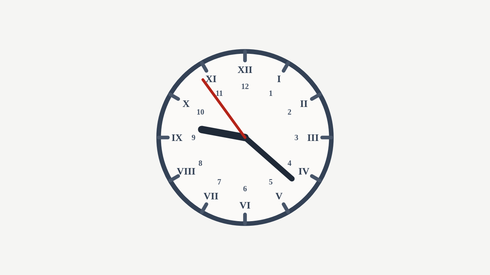

# alex-1883-test-32

A small static browser clock that shows the current local time on a responsive
SVG analog face with dual Roman and Arabic numeral rings. It uses plain HTML,
CSS, and JavaScript with no build step.



## Run

Open `index.html` directly in a browser, or serve the directory locally:

```bash
python3 -m http.server 8080 --bind 0.0.0.0
```

Then open:

```text
http://127.0.0.1:8080/
```

## Test

Install the Node dependencies first:

```bash
npm install
npx playwright install
```

Run the unit tests:

```bash
npm test
```

Run the Playwright end-to-end checks:

```bash
npm run test:e2e
```

The E2E suite verifies Chromium, Firefox, WebKit, and a mobile Chromium
viewport. It checks that the clock renders with both numeral rings, ticks, stays
within the viewport, and produces no browser console or page errors.

## Files

- `index.html`: page shell for the clock.
- `styles.css`: centered full-viewport layout and responsive analog clock styling.
- `clock.js`: hand angle computation, rendering, and tick scheduling.
- `test/compute-angles.test.js`: unit coverage for `computeAngles`.
- `test/render-clock.test.js`: unit coverage for hand rendering and tick timing.
- `e2e/clock.spec.js`: Playwright browser coverage.
